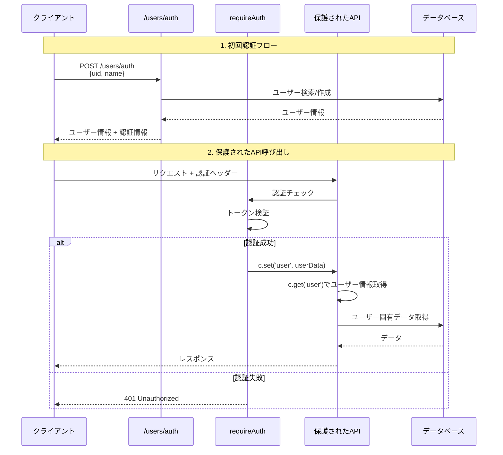

# 認証処理フロー図

## 全体の認証フロー



## APIエンドポイント別認証状況

```mermaid
graph TD
    A[API エンドポイント] --> B{認証が必要?}
    
    B -->|不要| C[認証なしエンドポイント]
    B -->|必要| D[requireAuth適用]
    
    C --> C1[POST /users/auth<br/>ユーザー認証・作成]
    C --> C2[GET /users/:uid<br/>ユーザー情報取得]
    
    D --> D1[GET /user-daily-summaries<br/>デイリーサマリー一覧]
    D --> D2[GET /user-daily-summaries/:id<br/>特定サマリー取得]
    D --> D3[GET /user-daily-summaries/:id/audio-urls<br/>音声URL取得]
    D --> D4[GET /saved-articles<br/>保存記事一覧]
    D --> D5[POST /saved-articles<br/>記事保存]
    D --> D6[GET /saved-articles/:id<br/>特定記事取得]
    D --> D7[DELETE /saved-articles/:id<br/>記事削除]
    
    D1 --> E[c.get('user')でユーザーID取得]
    D2 --> E
    D3 --> E
    D4 --> E
    D5 --> E
    D6 --> E
    D7 --> E
    
    E --> F[ユーザー固有データのみ取得]
```

## requireAuthミドルウェアの処理フロー

```mermaid
flowchart TD
    A[リクエスト受信] --> B[認証ヘッダー確認]
    
    B --> C{Authorization<br/>ヘッダー存在?}
    
    C -->|なし| D[401 Unauthorized<br/>認証が必要です]
    C -->|あり| E[トークン抽出]
    
    E --> F[トークン検証処理]
    F --> G{トークン有効?}
    
    G -->|無効| H[401 Unauthorized<br/>無効なトークンです]
    G -->|有効| I[ユーザー情報取得]
    
    I --> J[c.set('user', userData)]
    J --> K[次のミドルウェア/ハンドラーへ]
    
    K --> L[c.get('user')でユーザー情報取得可能]
```

## エラーケースと対処法

```mermaid
graph TD
    A[認証エラー] --> B{エラーの種類}
    
    B -->|認証ヘッダーなし| C[401: 認証が必要です]
    B -->|無効なトークン| D[401: 無効なトークンです]
    B -->|期限切れトークン| E[401: トークンの有効期限が切れています]
    B -->|requireAuth未適用| F[TypeError: Cannot read properties of undefined]
    
    F --> G[c.get('user')がundefinedを返す]
    G --> H[user.idアクセス時にエラー]
    
    H --> I[修正方法:<br/>requireAuthミドルウェアを追加]
    
    C --> J[クライアント:<br/>認証情報を付与してリトライ]
    D --> J
    E --> J
```

## 認証が必要な理由

### ユーザー固有データの保護
- デイリーサマリー: ユーザーごとの個人的な情報
- 保存記事: ユーザーが保存した記事リスト
- 音声URL: ユーザー専用の音声ファイル

### セキュリティ原則
- **認可制御**: 自分のデータのみアクセス可能
- **データ漏洩防止**: 他ユーザーのデータアクセス防止
- **監査ログ**: どのユーザーがアクセスしたか追跡可能

## 実装上の注意点

1. **c.get('user')を使用する全エンドポイントはrequireAuth必須**
2. **認証不要エンドポイント**:
   - `/users/auth`: 認証自体を行うため
   - `/users/:uid`: パスパラメータで直接検索するため
3. **エラーハンドリング**: 認証失敗時は適切なHTTPステータスコードを返す