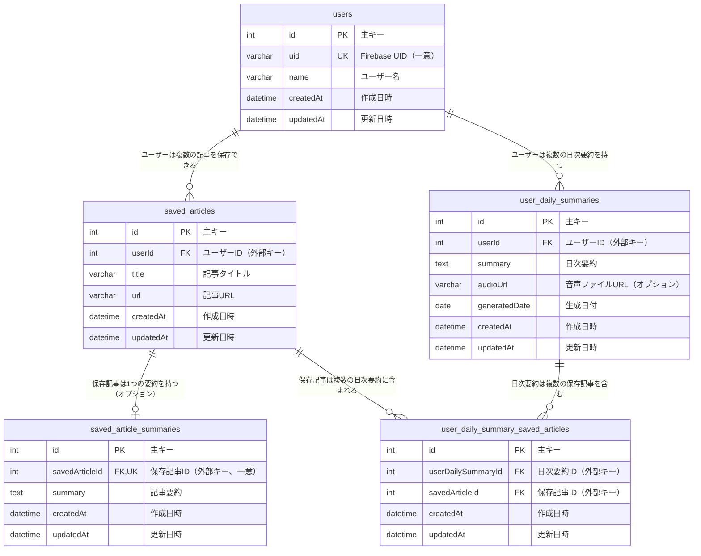

# ER図

## テーブル説明

### users（ユーザー）
- システムのユーザー情報を管理
- `uid`: Firebase Authentication のユーザーIDを格納（VARCHAR(255)、一意制約）
- `name`: ユーザー名（VARCHAR(255)）
- カスケード削除により、ユーザー削除時に関連データも削除される

### saved_articles（保存記事）
- ユーザーが保存した記事情報を管理
- `userId`でユーザーと関連付け
- `title`: 記事タイトル（VARCHAR(255)）
- `url`: 記事URL（VARCHAR(1024)）
- インデックスが`userId`と`createdAt`に設定されている

### saved_article_summaries（記事要約）
- 保存記事のAI生成要約を管理
- `savedArticleId`との1対1関係（オプション）
- `summary`: 記事要約（TEXT）
- 記事削除時にカスケード削除される

### user_daily_summaries（日次要約）
- ユーザーの日次要約情報を管理
- `summary`: 日次要約（TEXT）
- `audioUrl`: 音声合成されたファイルのURL（VARCHAR(255)、オプション）
- `generatedDate`: 要約対象の日付（DATE）
- ユーザーと日付の組み合わせで一意制約（userId, generatedDate）
- インデックスが`userId`と`createdAt`に設定されている

### user_daily_summary_saved_articles（関連テーブル）
- 日次要約と保存記事の多対多関係を管理
- どの記事が特定の日次要約に含まれているかを追跡
- 日次要約IDと保存記事IDの組み合わせで一意制約
- インデックスが`userDailySummaryId`と`savedArticleId`に設定されている