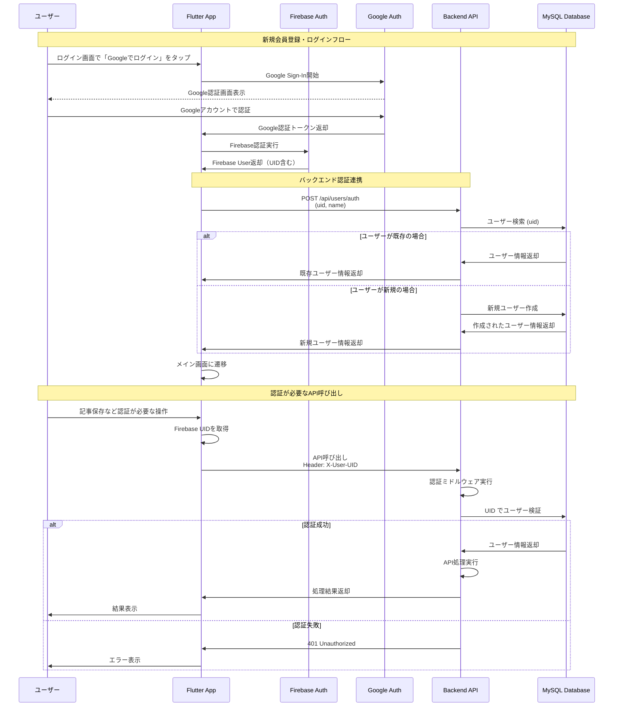

# summaryme.ai 認証システム設計書

## 概要

summaryme.aiは、Firebase AuthenticationとGoogle認証を使用した安全な認証システムを実装しています。フロントエンド（Flutter）とバックエンド（TypeScript/Hono）が連携し、シームレスなユーザー体験を提供します。

## 認証フロー図



## システム構成

### 1. フロントエンド (Flutter)

#### 認証関連ファイル構成
- `lib/screens/auth/login_screen.dart` - ログイン画面
- `lib/screens/auth/signup_screen.dart` - 会員登録画面（主にGoogle認証）
- `lib/services/auth_service.dart` - 認証サービス
- `lib/services/api_service.dart` - バックエンドAPI通信

#### 主要機能
- **Google認証**: `google_sign_in`パッケージを使用
- **Firebase認証**: `firebase_auth`パッケージを使用
- **認証状態管理**: Firebase Auth State Changesを監視
- **バックエンド連携**: UID をヘッダーに付けてAPI呼び出し

### 2. バックエンド (TypeScript/Hono)

#### 認証関連ファイル構成
- `src/apis/user.ts` - ユーザー認証API
- `src/middleware/auth.ts` - 認証ミドルウェア

#### 主要機能
- **ユーザー認証エンドポイント**: `POST /api/users/auth`
- **ユーザー情報取得**: `GET /api/users/:uid`
- **認証ミドルウェア**: `X-User-UID`ヘッダーによる認証

### 3. データベース (MySQL)

#### ユーザーテーブル構成
```sql
CREATE TABLE users (
  id INT AUTO_INCREMENT PRIMARY KEY,
  uid VARCHAR(255) UNIQUE NOT NULL,    -- Firebase UID
  name VARCHAR(255) NOT NULL,          -- ユーザー名
  created_at DATETIME DEFAULT NOW(),
  updated_at DATETIME ON UPDATE NOW()
);
```

## 認証フローの詳細

### 1. 初回ログイン・会員登録

1. **Googleログイン開始**
   - ユーザーが「Googleでログイン」ボタンをタップ
   - `AuthService.signInWithGoogle()`が呼び出される

2. **Google認証**
   - Google Sign-Inが開始され、Googleの認証画面が表示
   - ユーザーがGoogleアカウントで認証

3. **Firebase認証**
   - GoogleトークンをFirebase認証に渡す
   - Firebase UserオブジェクトとUIDが生成される

4. **バックエンド連携**
   - `ApiService.authenticateUser()`でバックエンドに認証情報送信
   - UIDと表示名を`POST /api/users/auth`に送信

5. **ユーザー作成/取得**
   - バックエンドでUIDによる既存ユーザー検索
   - 存在しない場合は新規ユーザー作成
   - ユーザー情報をフロントエンドに返却

6. **アプリ画面遷移**
   - `MainTabScreen`に遷移してアプリの主要機能にアクセス

### 2. 認証が必要なAPI呼び出し

1. **API呼び出し準備**
   - `ApiService._getAuthHeaders()`でFirebase UIDを取得
   - `X-User-UID`ヘッダーに設定

2. **認証ミドルウェア処理**
   - `requireAuth`ミドルウェアが`X-User-UID`ヘッダーを検証
   - データベースでUIDに対応するユーザーを検索

3. **API処理実行**
   - 認証成功時：ユーザー情報がコンテキストに設定され、API処理実行
   - 認証失敗時：401 Unauthorizedエラーを返却

### 3. ログアウト

1. **ログアウト処理**
   - `AuthService.signOut()`が呼び出される
   - Firebase AuthとGoogle Sign-Inの両方からログアウト

2. **状態リセット**
   - 認証状態がリセットされ、ログイン画面に戻る

## セキュリティ特徴

### 1. Firebase Authentication
- **Google OAuth 2.0**による安全な認証
- **JWT トークン**による認証状態管理
- **自動トークンリフレッシュ**

### 2. バックエンド認証
- **UID ベース認証**：推測困難なFirebase UIDを使用
- **ステートレス認証**：セッション管理不要
- **データベース整合性**：外部キー制約によるデータ保護

### 3. API セキュリティ
- **必須認証ヘッダー**：`X-User-UID`による認証
- **ユーザー分離**：各ユーザーは自分のデータのみアクセス可能
- **入力検証**：Zodスキーマによるリクエスト検証

## デバッグ機能

開発環境では以下のデバッグ機能が利用可能：

- **認証スキップ**：Debug Mode時に「Skip Auth」ボタンでログインをバイパス
- **ログ出力**：認証プロセスの詳細なログ出力
- **エラーハンドリング**：認証エラーの詳細表示

## 運用上の考慮事項

### 1. エラーハンドリング
- Firebase認証エラーの適切な処理
- ネットワークエラー時の再試行機能
- バックエンド認証失敗時のサイレント処理

### 2. ユーザー体験
- 認証プロセス中のローディング表示
- 認証失敗時の分かりやすいエラーメッセージ
- 自動ログイン機能

### 3. 拡張性
- 将来的な認証プロバイダー追加への対応
- ユーザープロファイル情報の拡張可能性
- 権限管理システムへの発展性

## まとめ

summaryme.aiの認証システムは、Firebase AuthenticationとGoogle認証を組み合わせることで、安全で使いやすい認証体験を提供しています。フロントエンドとバックエンドが適切に連携し、ユーザーデータの分離とセキュリティを確保しています。