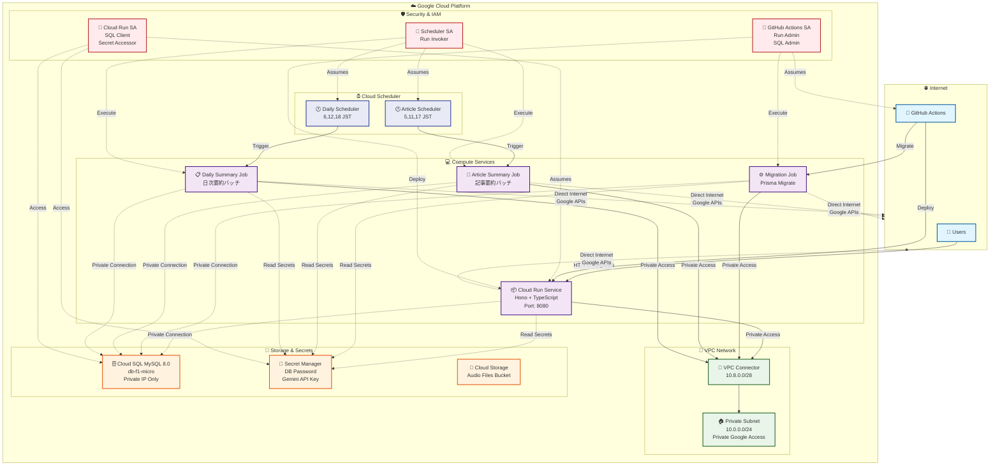
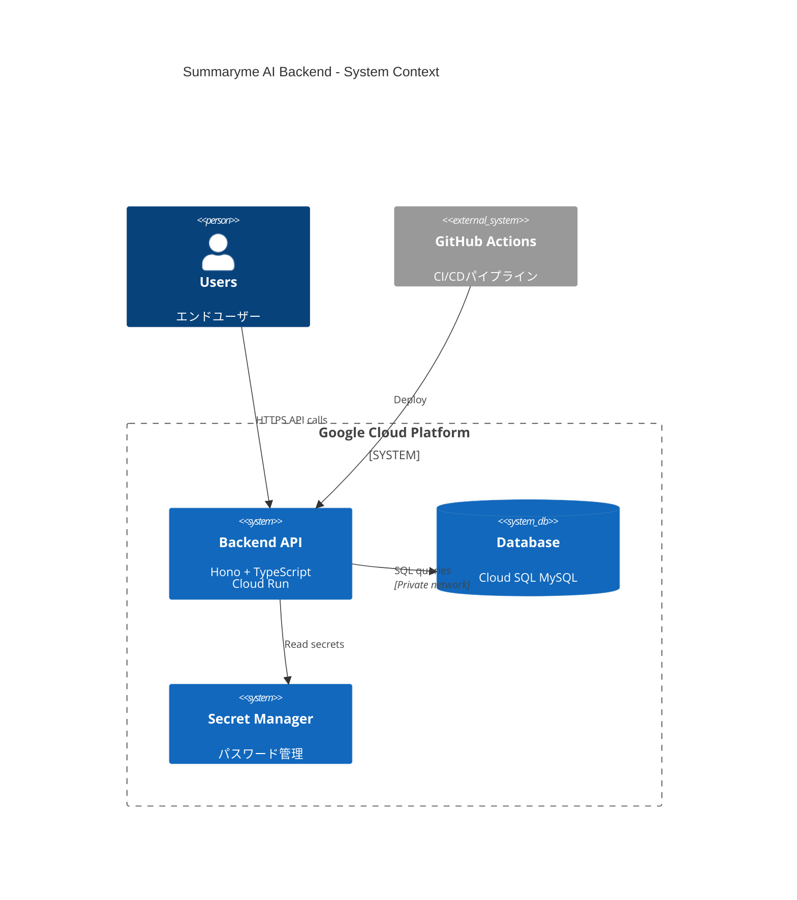
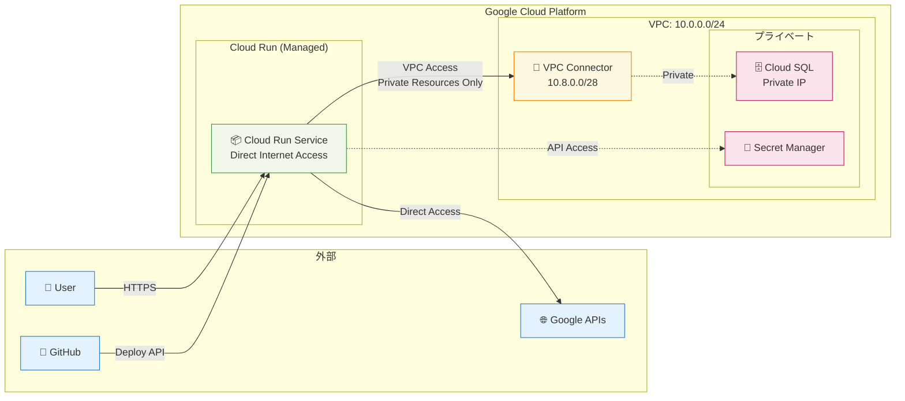

# Summaryme AI Backend - インフラ構成図

## アーキテクチャ概要

このドキュメントは、Terraformで管理されているSummaryme AI Backendのインフラ構成を視覚化したものです。

## インフラ構成図



## 簡略版構成図（C4 Context Level）



## ネットワーク詳細図



## 主要コンポーネント

### 🌐 Internet Layer
- **Users**: エンドユーザーからのHTTPSリクエスト
- **GitHub Actions**: CI/CDパイプラインからのデプロイ

### ☁️ Google Cloud Platform

#### Compute Services
- **Cloud Run Service**: メインのバックエンドAPI（Hono + TypeScript）
  - ポート: 8080
  - 自動スケーリング: 0-10インスタンス
  - ヘルスチェック: `/health`エンドポイント
- **Migration Job**: Prismaマイグレーション実行用ジョブ
- **Article Summary Job**: 記事要約バッチ処理
- **Daily Summary Job**: 日次要約バッチ処理

#### VPC Network
- **VPC Connector**: Cloud RunとVPC間の接続
  - IP範囲: `10.8.0.0/28`
- **Private Subnet**: プライベートネットワーク
  - IP範囲: `10.0.0.0/24`
- **Cloud Router**: VPCルーティング管理
- **Cloud NAT**: アウトバウンドインターネットアクセス

#### Cloud Scheduler
- **Article Summary Scheduler**: 記事要約ジョブのスケジュール実行
  - 実行時刻: 5時、11時、17時 (JST)
- **Daily Summary Scheduler**: 日次要約ジョブのスケジュール実行
  - 実行時刻: 6時、12時、18時 (JST)

#### Storage & Secrets
- **Cloud SQL MySQL**: メインデータベース
  - バージョン: MySQL 8.0
  - ティア: db-f1-micro
  - プライベート接続のみ
- **Secret Manager**: シークレット管理
  - データベースパスワード
  - Gemini APIキー
- **Cloud Storage**: 音声ファイル保存用バケット

#### Security & IAM
- **Cloud Run Service Account**: Cloud Run用の最小権限
  - Cloud SQL Client
  - Secret Manager Accessor
  - Storage Object Admin
- **GitHub Actions Service Account**: CI/CD用権限
  - Cloud Run Admin
  - Cloud SQL Admin
  - Secret Manager Admin
- **Cloud Scheduler Service Account**: スケジューラー用権限
  - Cloud Run Invoker

## ネットワークフロー

### 1. ユーザーリクエスト
```
User → Cloud Run Service (Direct HTTPS) → VPC Connector → Private Subnet → Cloud SQL
```

### 2. デプロイメント
```
GitHub Actions → Cloud Run Service (新バージョンデプロイ)
GitHub Actions → Migration Job (データベースマイグレーション)
```

### 3. スケジュール実行
```
Cloud Scheduler → Article Summary Job (定期実行)
Cloud Scheduler → Daily Summary Job (定期実行)
```

### 4. アウトバウンド通信
```
Cloud Run → Direct Internet Access (Google Frontend経由)
※ Cloud NATは不要 - Cloud Runは直接インターネットアクセス可能
```

### 5. プライベートリソースアクセス
```
Cloud Run → VPC Connector → Private Subnet → Cloud SQL (Private IP)
Cloud Run → Secret Manager (Google APIs経由)
```

## セキュリティ特徴

- **プライベートネットワーク**: Cloud SQLはプライベートIPのみ
- **最小権限の原則**: 各サービスアカウントは必要最小限の権限
- **Secret管理**: パスワードはSecret Managerで暗号化保存
- **VPC分離**: 全てのリソースがプライベートVPC内で動作

## 監視・ログ

- Cloud Runの自動ログ収集
- ヘルスチェックによる可用性監視
- Cloud SQLの接続監視
- VPCフローログ（エラーのみ）

---

**生成日**: 2025/05/31
**更新日**: 2025/06/22
**Terraformバージョン**: 1.5+
**プロジェクト**: Summaryme AI Backend